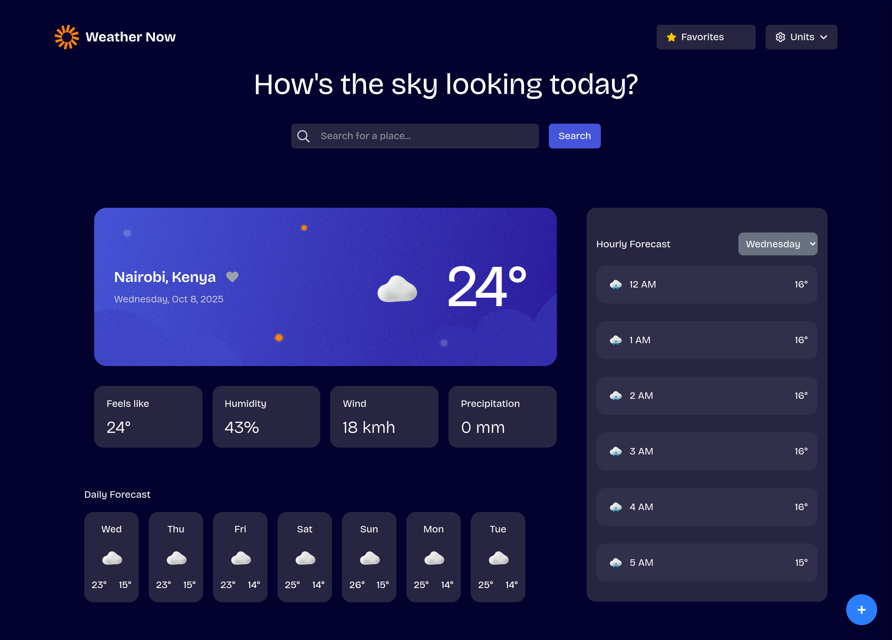

# Frontend Mentor - Weather app solution

This is a solution to the [Weather app challenge on Frontend Mentor](https://www.frontendmentor.io/challenges/weather-app-K1FhddVm49). Frontend Mentor challenges help you improve your coding skills by building realistic projects.

## Table of contents

- [Overview](#overview)
  - [The challenge](#the-challenge)
  - [Screenshot](#screenshot)
  - [Links](#links)
- [My process](#my-process)
  - [Built with](#built-with)
  - [What I learned](#what-i-learned)
  - [Continued development](#continued-development)
  - [Useful resources](#useful-resources)
- [Author](#author)
- [Acknowledgments](#acknowledgments)

## Overview

### The challenge

Users should be able to:

- Search for weather information by entering a location in the search bar
- View current weather conditions including temperature, weather icon, and location details
- See additional weather metrics like "feels like" temperature, humidity percentage, wind speed, and precipitation amounts
- Browse a 7-day weather forecast with daily high/low temperatures and weather icons
- View an hourly forecast showing temperature changes throughout the day
- Switch between different days of the week using the day selector in the hourly forecast section
- Toggle between Imperial and Metric measurement units via the units dropdown
- Switch between specific temperature units (Celsius and Fahrenheit) and measurement units for wind speed (km/h and mph) and precipitation (millimeters) via the units dropdown
- View the optimal layout for the interface depending on their device's screen size
- See hover and focus states for all interactive elements on the page

### Screenshot

### Links

- Solution URL: [solution URL here](https://github.com/nickonyi/Weather-App-main.git)
- Live Site URL: [live site URL here](https://weather-app-main-weld.vercel.app)

## My process

### Built with

- Semantic HTML5 markup
- CSS custom properties
- Flexbox
- CSS Grid
- Mobile-first workflow
- tailwindcss
- [React](https://reactjs.org/) - JS library
- Vite build setup (depending on your configuration)

### What I learned

- This project helped me strengthen my understanding of:
- Handling APIs in React using fetch and async/await
- Managing component state and lifting state up for shared data
- Creating responsive layouts efficiently with Tailwind’s utility classes
- Implementing dynamic rendering for hourly and daily forecasts
- Managing unit conversions (metric ↔ imperial) across components
- I also improved my ability to organize components and maintain clean, readable code with proper state separation between current weather, forecast, and favorites.

### Continued development

In the future, I’d like to:

- Implement offline caching using service workers
- Refine UI transitions and animations for a smoother experience
- Add dark/light mode toggle

### Useful resources

- Tailwind CSS Documentation – [https://tailwindcss.com/docs/installation/using-vite]Great reference for quick styling and responsive design.
- React Documentation – [https://react.dev]Clear explanations on state and effect management.
- OpenWeatherMap API Docs – [https://openweathermap.org/api]Essential for integrating real-time weather data.
- MDN Web Docs – [https://developer.mozilla.org/]Helped clarify certain JavaScript and CSS concepts.

## Author

- Frontend Mentor - [@nick_onyi](https://www.frontendmentor.io/profile/nickonyi)

## Acknowledgments

This project was built independently, but I drew inspiration from various Frontend Mentor community solutions and documentation examples that guided UI improvements and responsive layout ideas.
